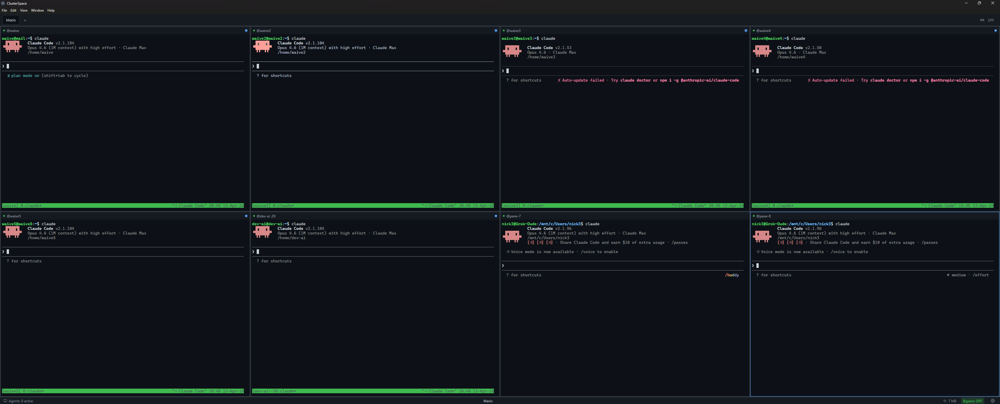

<div align="center">

# ⚡ ClusterSpace

**A tiled workspace for terminals, browsers, SSH+tmux sessions, and AI agents — laid out the way you think, driven as far as you let it.**

[](https://www.electronjs.org/)
[](https://reactjs.org/)
[](https://www.typescriptlang.org/)
[](https://nodejs.org/)
[](#quick-start)
[](LICENSE)
[](#contributing)

ClusterSpace turns "I have nine terminals open across four monitors" into one tiled workspace with persistent sessions, embedded browsers, autonomous AI agents that can drive panes to completion, and a live dashboard of everything they're doing.



*Eight Claude Code agents running concurrently across panes, tracked live — see [Multi-Agent Orchestration](#-multi-agent-orchestration).*

</div>

---

<details>
<summary><b>📖 Table of Contents</b></summary>

- [Why](#why)
- [Features](#features)
  - [Workspaces & Layout](#-workspaces--layout)
  - [Terminal Panes](#-terminal-panes)
  - [Browser Panes](#-browser-panes)
  - [AI Co-Pilot](#-ai-co-pilot-optional)
  - [Autonomous Goals](#-autonomous-goals)
  - [Multi-Agent Orchestration](#-multi-agent-orchestration)
  - [Remote Web Access](#-remote-web-access)
  - [Quality of Life](#-quality-of-life)
- [Quick Start](#quick-start)
- [Keyboard](#keyboard)
- [SSH + tmux Architecture](#ssh--tmux-architecture)
- [Architecture at a Glance](#architecture-at-a-glance)
- [Project Structure](#project-structure)
- [Data Locations](#data-locations)
- [Tech Stack](#tech-stack)
- [Status](#status)
- [Contributing](#contributing)
- [License](#license)

</details>

---

## Why

Most terminal apps give you tabs and split panes. ClusterSpace goes further:

- **Sessions are sacred.** SSH connections wrap in tmux automatically; switching workspaces, closing the app, or losing your network never costs you state. Reopen and reattach exactly where you left off.
- **Panes mean anything.** A pane can be a terminal, an SSH session with its own tmux tab strip, a full Chromium browser, or an AI-driven worker. Mix freely in one workspace.
- **The AI can drive — and finish.** Give an agent a goal and it loops autonomously (read, act, verify, repeat) until it can prove the goal is done, not just until it stops talking. Risk-tiered approval gates keep it honest.
- **Agents work as a fleet.** Spin up several agents across panes, assign them tasks, let them share context, and watch it all on one live dashboard — not one chat window per agent.
- **It follows you.** An optional, password-protected web server lets you check on or drive your panes from a phone or another machine.
- **Multi-tab per pane, but actually independent.** Each tab inside a terminal pane is its own SSH connection attached to a different tmux session on the host — switch tabs = swap which xterm is visible, zero commands typed into your shell.

---

## Features

### 🧱 Workspaces & Layout
- Configurable grid (1×1 to 4×4); panes drag-to-resize via gutter handles
- Drag-and-drop pane swap by the label
- Multiple workspaces ("groups") with per-workspace pane layouts
- Window size, position, and maximized state persist across launches
- Workspace switching preserves all PTYs — switch back and your `htop` is still running

### 💻 Terminal Panes
- xterm.js with WebGL renderer, full-color, bracketed-paste-aware
- **Per-pane tabs** = independent tmux sessions on the same host (one SSH connection each, fully isolated)
- Auto-wrap SSH in `tmux new-session -A -s <name>` for persistent remote sessions
- **Remote session picker**: list and reattach to existing tmux sessions; recover sessions from before naming changes; works with key-auth (auto-list) and password-auth (manual entry with smart suggestions)
- Close-pane confirm dialog: keep or destroy the remote tmux session
- "Disable App Mouse" toggle per pane — native drag-select works without modifiers even when tmux/vim mouse mode is on
- Smart clipboard: `Ctrl+Shift+C` copies, `Ctrl+V` pastes with bracketed-paste, `Ctrl+C` always SIGINTs
- Auto-detect SSH password prompt and inject stored credentials — works whether you're at the keyboard or connecting remotely (see [Remote Web Access](#-remote-web-access))

### 🌐 Browser Panes
- Full Chromium webview with back/forward/reload, address bar, bookmarks, history, downloads, find-in-page
- **Multi-tab browser** with persisted tab state (title, favicon, URL all survive restart), pinnable tabs
- **Real popups and new tabs**: OAuth-style "Sign in with Google/GitHub" opens an actual popup window (so `postMessage` completion works), while plain links open real new tabs instead of hijacking the current one
- **Idle background tabs auto-discard** to free memory/CPU (configurable threshold, default 15 min) — exempt if pinned or playing audio/video
- Full right-click context menu: open-in-new-tab, save/copy images, video/audio save, spellcheck suggestions + add-to-dictionary, not just a generic stub
- Custom user-agent presented to avoid bot-detection on common services
- Saved logins with per-origin matching (Electron `safeStorage` = OS keychain; passwords never cross the renderer boundary except for the explicit "Show password" action)
- "Fill saved login" in the pane overflow menu — injects credentials into focused inputs without auto-submit

### 🤖 AI Co-Pilot (optional)
- Bring-your-own provider: Claude, OpenAI, Ollama, anything OpenAI-compatible
- **71 tools** the model can call, spanning terminal I/O, pane/workspace control, and ~50 dedicated browser-automation tools — navigate/click/type/scroll/drag, screenshot (including annotated + full-page), accessibility-tree reads, cookie/PDF/HTML export, and a pair of vision tools that judge or describe what's on screen after an action
- **Recipes** — save a sequence of tool calls as a named, replayable macro with per-step retry semantics
- **Plugin system** — drop your own JS tool definitions in the config directory; they hot-reload and can override built-ins
- Per-pane agent state (idle/working/blocked/complete/error) shown in the label
- Personas, task templates, and skills loaded from your config directory
- Action log for browser automation with human-approval gates, risk-tiered (see [Autonomous Goals](#-autonomous-goals))

### 🎯 Autonomous Goals
- Hand a pane a goal instead of a single instruction — the agent runs an unbounded read → act → verify loop (with a wall-clock safety cap) until it can prove the goal is actually done, not just until it stops talking
- Built-in loop-guard and drift detection catch an agent repeating itself or wandering off the original ask
- **Risk-tiered approval policy** — actions are classified `read_only` → `write_local` → `network_get` → `network_write` → `spends_money`, and anything past your comfort tier pauses for a human nod before it executes
- Live **Goal Dashboard** (`Ctrl+Shift+G`) to create, monitor, and pause goals with status and elapsed time

### 🐝 Multi-Agent Orchestration
- Assign different roles/tasks to agents running in different panes and let them coordinate — share context, wait on each other, report task completion or failure
- Live **Fleet Dashboard** showing every active agent's status (idle/working/blocked/complete/error) as a card with progress — the screenshot at the top of this README is this feature in action, 8 agents deep
- Built for the "one operator, many agents" workflow, not one chat window per task

### 📡 Remote Web Access
- Optional, **off by default** HTTP(S) + WebSocket server (default port 4444) bundled with the app — no separate install
- Password-protected login serves a small web client (works on a phone) that lists every pane across your active workspace, grouped and collapsible
- **Terminals**: full scrollback + live bidirectional stream over WebSocket, same as sitting at the machine
- **Browser panes**: watch a live frame stream and click/type/scroll remotely (CDP-driven input, indistinguishable from local use); unchanged frames are skipped to save bandwidth
- Optional TLS, configurable bind address — since this opens a real network-listening, credentialed control surface, it's explicit opt-in with a confirmation step in Settings, not something enabled by default

### ✨ Quality of Life
- Command palette (`Ctrl+Shift+P`) for every action
- Broadcast mode — type once, send to all selected panes
- Per-pane context menu with copy/paste/select-all, "Convert to Browser/Terminal", "Attach to tmux session...", and more
- SSH server manager with password and key auth
- Workspaces export/import as portable JSON

---

## Quick Start

```bash
git clone https://github.com/mtecnic/clusterspace.git
cd clusterspace
npm install
npm run rebuild   # native module rebuild for Electron
npm run dev
```

### Build a distributable

```bash
npm run build      # type-check + bundle
npm run dist       # build + package via electron-builder
```

> **Packaged installers are Windows-only today** (`electron-builder.yml` currently only configures an NSIS/x64 target). The app itself — Electron, xterm.js, node-pty — runs fine cross-platform, so `npm run dev` works on macOS/Linux for development; there just isn't a packaged mac/linux build yet.

### Prerequisites
- **Node.js 20+**
- **Windows** (packaging + primary target): Visual Studio Build Tools 2022 + C++ workload (for `node-pty`)
- **macOS/Linux** (development only, no packaged build yet): standard build toolchain (Xcode CLT or build-essential)
- **Remote hosts**: tmux must be installed if you want the SSH session-persistence layer

---

## Keyboard

| | |
|---|---|
| `Ctrl+Shift+P` | Command palette |
| `Ctrl+T` | New workspace |
| `Ctrl+W` | Close workspace |
| `Ctrl+1` … `Ctrl+9` | Switch to workspace N |
| `Ctrl+Tab` / `Ctrl+Shift+Tab` | Next / previous workspace |
| `Ctrl+B` | Toggle broadcast mode |
| `Ctrl+Enter` | Maximize / restore focused pane |
| `Ctrl+R` | Restart focused pane |
| `Alt+←/→/↑/↓` | Navigate focus between panes |
| `Ctrl+Shift+A` | Toggle AI chat panel |
| `Ctrl+Shift+G` | Toggle Goal Dashboard |
| `Ctrl+Shift+C` | Copy selection (in a terminal) |
| `Ctrl+V` | Paste (bracketed-paste-aware) |
| `Ctrl+C` | Always SIGINT — never copies |
| `Shift+drag` or `Alt+drag` | Native xterm select, bypasses app mouse mode |
| Right-click pane | Per-pane context menu |
| Double-click label | Maximize / restore pane |
| Drag label | Swap pane positions |

---

## SSH + tmux Architecture

When you mark a pane as an SSH connection, ClusterSpace invokes:

```bash
ssh -t user@host tmux new-session -A -s <session-name>
```

- `-A` attaches if the named session exists, otherwise creates it.
- Default session name is **per-pane** (`clusterspace-pane-<paneId-short>`), so two panes connecting to the same host don't echo into each other.
- You can override the session for any pane via right-click → **Attach to tmux session…** — recovers older or shared sessions.

For multi-tab terminal panes, each tab opens its **own** SSH connection attached to a different tmux session. There's no "switch-client" magic; tab switches are pure CSS, and the cost is one extra SSH process per tab (typically negligible).

Closing a tab kills the local PTY but leaves the remote tmux session alive (you can reattach later). The kill-confirm dialog gives you "Destroy remote session" if you want it gone permanently.

---

## Architecture at a Glance

```
┌──────────────────────────────────────────────────────────────────┐
│  Renderer (React + xterm.js + Chromium webview)                  │
│  ┌──────────────┐ ┌──────────────┐ ┌─────────────┐ ┌───────────┐ │
│  │ TerminalPane │ │ BrowserPane  │ │ AI Chat /   │ │ Fleet /   │ │
│  │  └ TabContent│ │  └ webview   │ │ Goal panels │ │ Goal      │ │
│  │     └ xterm  │ │  └ tabs      │ └─────────────┘ │ Dashboard │ │
│  └──────────────┘ └──────────────┘                 └───────────┘ │
└─────────────────────────┬──────────────────────────────────────┬─┘
                          │ IPC (contextBridge)                  │ HTTP + WebSocket
┌─────────────────────────┴────────────────────────────┐   ┌─────┴──────────┐
│  Main (Electron)                                      │   │ Remote client  │
│ ┌───────────┐ ┌────────────┐ ┌──────────┐ ┌─────────┐ │   │ (any browser,  │
│ │ PtyManager│ │ Workspace/ │ │ AIManager│ │ Goal-   │ │   │  port 4444)    │
│ │ (node-pty)│ │ Credential/│ │ (provider│ │ Runner /│ │   └────────────────┘
│ │           │ │ Browser    │ │ + tool   │ │ Orches- │ │
│ │           │ │ stores     │ │ dispatch)│ │ tration │ │
│ └───────────┘ └────────────┘ └──────────┘ └─────────┘ │
└─────────────────────────────────────────────────────────┘
```

- **Process boundary**: secure IPC via preload + `contextBridge` (no `nodeIntegration`, no `remote`).
- **PTY lifecycle**: PTYs are keyed by `paneId` (or `${paneId}:${tabId}` for multi-tab panes) and survive React unmounts. They're only killed via explicit user action, tab close, workspace delete, or app exit — workspace switching uses `backgroundWorkspace` / `foregroundWorkspace` to throttle data streams without losing connections.
- **Credentials**: SSH and browser-site passwords go through Electron's `safeStorage` (DPAPI on Windows, Keychain on macOS, libsecret on Linux). Plaintext never lives in the config files.
- **Remote access** reuses the same pane-control round trip the AI tools use — a remote client driving a pane is, at the IPC/WebContents level, indistinguishable from local automation.

---

## Project Structure

<details>
<summary>Click to expand full source tree</summary>

```
src/
├── main/                             # Electron main process
│   ├── index.ts                      # App bootstrap, IPC handlers, window state
│   ├── pty-manager.ts                # node-pty lifecycle + workspace background/foreground
│   ├── workspace-store.ts            # Workspaces, panes, settings (electron-store)
│   ├── credentials-store.ts          # SSH server credentials (safeStorage)
│   ├── browser-credentials-store.ts  # Saved logins per origin (safeStorage)
│   ├── browser-store.ts              # Bookmarks, history, downloads
│   ├── browser-pane-registry.ts      # webContents registry (active + all-tabs) for AI/remote control
│   ├── browser-recipes.ts            # Save/replay recorded tool-call sequences
│   ├── ai-manager.ts                 # AI provider + tool dispatch
│   ├── ai-tools/                     # Tool implementations (terminal, pane, orchestration, browser/*)
│   ├── goal-runner.ts                # Autonomous read→act→verify loop, wall-clock capped
│   ├── goal-store.ts                 # Goal persistence, checkpoints, status
│   ├── goal-policy.ts                # Risk-tiered action approval (read_only → spends_money)
│   ├── agent-store.ts                # Per-pane agent status for the Fleet Dashboard
│   ├── orchestration-store.ts        # Cross-pane task assignment + shared context
│   ├── plugin-loader.ts              # Hot-reloads user-authored JS tools
│   └── remote-server/                # HTTP + WebSocket server for remote web access
│       ├── server.ts                 # HTTP/HTTPS bootstrap
│       ├── auth-routes.ts            # Login, session tokens, rate limiting
│       ├── api-routes.ts             # REST: list panes, switch tab, etc.
│       ├── ws-terminal.ts            # PTY ↔ WebSocket relay
│       └── ws-browser.ts             # Browser-pane frame streaming + remote input
├── preload/index.ts                  # Secure IPC bridge
├── renderer/
│   ├── App.tsx
│   ├── components/
│   │   ├── PaneGrid.tsx              # Grid layout, resize handles, drag-swap
│   │   ├── TerminalPane.tsx          # Tab strip, label, prompt dialogs
│   │   ├── TerminalTabContent.tsx    # One xterm + useTerminal per tab
│   │   ├── BrowserPane.tsx
│   │   ├── BrowserCredentialsDialog.tsx
│   │   ├── TmuxSessionPicker.tsx
│   │   ├── AIChatPanel.tsx
│   │   ├── GoalDashboard.tsx         # Create/monitor/pause autonomous goals
│   │   ├── FleetDashboard.tsx        # Live per-pane agent status
│   │   ├── RemoteAccessSettingsDialog.tsx
│   │   └── ...
│   ├── context/                      # Workspace + AI + Agent contexts
│   └── hooks/useTerminal.ts          # xterm + PTY lifecycle
└── shared/types.ts                   # Cross-process types + IPC channel constants

resources/remote-client/              # Static web client served by the remote-access server
```

</details>

---

## Data Locations

| Platform | Path |
|---|---|
| Windows | `%APPDATA%\clusterspace\` |
| macOS *(dev only)* | `~/Library/Application Support/clusterspace/` |
| Linux *(dev only)* | `~/.config/clusterspace/` |

| File | Contents |
|---|---|
| `clusterspace-config.json` | Workspaces, panes, layout weights, window state, settings |
| `clusterspace-credentials.json` | SSH servers (passwords encrypted) |
| `clusterspace-browser-credentials.json` | Saved site logins (passwords encrypted) |
| `clusterspace-browser-store.json` | Bookmarks, history, downloads |
| `clusterspace-recipes.json` | Saved/replayable browser-automation recipes |
| `clusterspace-goals.json` | Autonomous goal definitions, checkpoints, status |
| `clusterspace-agents.json` | Per-pane agent state for the Fleet Dashboard |
| `clusterspace-orchestration.json` | Cross-pane task assignments + shared context |
| `clusterspace-remote-access.json` | Remote-access credentials (hashed) and server settings |

---

## Tech Stack

| | |
|---|---|
| Framework | Electron 33 |
| Frontend | React 18 + TypeScript 5 |
| Terminal | xterm.js (WebGL renderer) |
| PTY | node-pty (ConPTY on Windows) |
| Browser panes | Chromium `<webview>` |
| Remote access | `ws` (WebSocket) + Node's built-in `http`/`https` |
| Styling | Tailwind CSS + hand-rolled CSS |
| Bundler | Vite + tsc |
| Storage | electron-store + Electron safeStorage |
| AI | OpenAI-compatible client (Claude via Anthropic-compat shim, local LLMs via Ollama) |

---

## Status

Active development. Recent landed work:

- ✅ Autonomous Goal Runner with risk-tiered approval policy + Goal Dashboard
- ✅ Multi-agent orchestration + Fleet Dashboard
- ✅ Remote web access (port 4444): terminal + browser pane control from any browser
- ✅ Browser-pane hardening: real OAuth popups, real new tabs, idle-tab memory discard, full context menu
- ✅ PTY-per-tab architecture (each terminal tab is its own SSH connection)
- ✅ Browser panes with multi-tab + saved-logins

Roadmap candidates: tmux control mode (invisible tab-switch commands), more AI orchestration recipes, additional pane types (markdown notes? webhook log tail?), macOS/Linux packaged builds.

---

## Contributing

PRs welcome. The code prefers explicit, readable patterns over clever ones; small focused commits over one big push. If you're adding a feature, the most useful conventions to follow:

- New IPC channels live in `src/shared/types.ts` under `IPC_CHANNELS` and are bridged in `src/preload/index.ts`.
- Pane state is in `PaneConfig` (`src/shared/types.ts`); add optional fields so old configs keep loading.
- The PTY lifecycle is touchy — read `pty-manager.ts` and the comment block in `useTerminal.ts`'s init `useEffect` before changing kill paths.
- New AI tools follow the pattern in `src/main/ai-tools/` — most are grouped by domain (`terminal.ts`, `pane.ts`, `orchestration.ts`, `browser/*.ts`); give risky ones a `goal-policy.ts` risk tier.

---

## License

[MIT](LICENSE)
